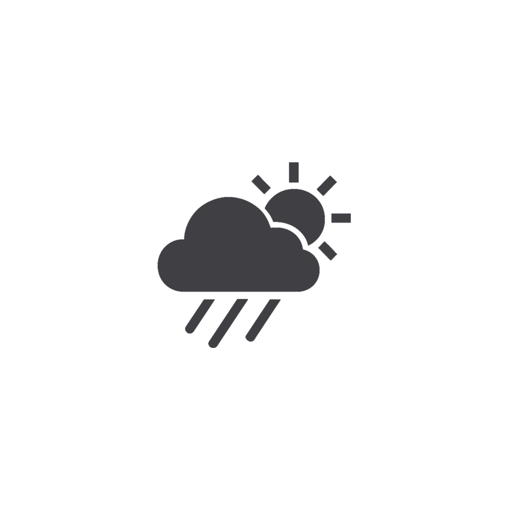

<div align="center">



# WeatherWell

**Ad-free weather forecasts, with smart daily insights.**

No ads. No accounts. No tracking. Just the weather — and a nudge when you'll need an umbrella.

[](https://github.com/SepehrMohammady/WeatherWell/releases/latest)
[](https://github.com/SepehrMohammady/WeatherWell/releases)
[](LICENSE)
[](https://semo-lab.com/weatherwell/privacy-policy/)

[**⬇ Download**](https://github.com/SepehrMohammady/WeatherWell/releases/latest) · [**🌐 Website**](https://semo-lab.com/weatherwell/) · [**🔒 Privacy Policy**](https://semo-lab.com/weatherwell/privacy-policy/)

</div>

---

## Why WeatherWell?

Most weather apps sell your location to advertisers. This one doesn't have advertisers.

WeatherWell ships with **no advertising SDK, no analytics, no crash reporting and no user accounts** — verified by an audit of its own source. Your coordinates go to the weather service *you* choose and nowhere else; your settings, favourites and cached forecasts never leave your phone. There's nothing to sign up for and nothing to switch off.

It's also **free and open source** under the MIT licence.

## What it does

### 🌤️ The weather itself
Current conditions, a 24-hour hourly strip that starts at the hour you're in, and a 7-day forecast. Temperature and feels-like, wind speed and direction, precipitation, UV index, visibility, humidity, pressure — and **air quality** with PM2.5 readings, all in tappable tiles that open a detail view with a plain-English explanation.

### 🎯 Smart daily insights
The app reads the rest of your day and tells you what to do about it:

| Insight | What it tells you |
|---|---|
| **Umbrella Alert** | Whether to take one, based on the highest rain chance in your remaining hours |
| **Clothing Suggestion** | What to wear, based on the *coldest* hour still ahead — not just right now |
| **UV Protection** | Sunglasses and sunscreen advice from the peak UV still to come |
| **Air Quality** | Mask and outdoor-activity guidance from the current AQI |

### 🔔 Alerts that respect your settings
Rain, UV, strong wind, high and low temperature, and air quality — each with a threshold you set yourself. Add a scheduled daily and hourly forecast at times you pick. Alerts keep working when the app is closed, and a cooldown stops the same warning arriving twice.

### 📱 Home-screen widget
Resizable, with its own refresh button that fetches fresh weather without opening the app. Choose what it shows: feels-like, high/low, rain chance, conditions, tomorrow's forecast — and how transparent it sits on your wallpaper.

### 🧭 And the rest
- **Live compass** showing wind direction against your device's real heading
- **Astronomy** — sunrise, sunset, moon phase and illumination, per day
- **Share a weather report** with exactly the sections you want, astronomy included
- **Favourite cities** with worldwide search
- **Backup & restore** every setting and favourite to a file you keep
- **Light and dark themes**, °C or °F

## Choose your weather source

Six providers, switchable at any time in Settings. The app ships with working keys, and you can drop in your own.

| Provider | Good for | Your own key? |
|---|---|---|
| **WeatherAPI** *(default)* | Comprehensive global data with air quality | Optional |
| **OpenWeatherMap** | Reliable worldwide forecasts | Optional |
| **Visual Crossing** | Detailed weather intelligence | Optional |
| **Open-Meteo** | Free and open — no key at all | Not needed |
| **QWeather** | Strong coverage in China and Asia | Optional |
| **Meteostat** | Historical observations | Optional (RapidAPI) |

If your chosen provider is unreachable, WeatherWell quietly falls back to another so you still get a forecast.

## Get it

**[Download the latest APK →](https://github.com/SepehrMohammady/WeatherWell/releases/latest)**

Requires **Android 7.0 or newer**. Not on Google Play yet, so Android will ask you to approve the install from your browser.

> **Upgrading from 0.7.x?** The app ID changed, so the new version installs alongside the old one. Export a backup from the old app first (**Settings → Export Backup**), import it into the new one, then uninstall the old app.

## Privacy in one paragraph

WeatherWell collects nothing. There are no accounts, no analytics, no crash reporting and no ads. When you look up the weather, your coordinates — or the city you searched — go to the weather provider you selected, which sees your IP address as any web request would. Everything else, including settings, favourites and cached forecasts, stays in the app's private storage on your device. Uninstalling removes it all.

Full details: **[Privacy Policy](https://semo-lab.com/weatherwell/privacy-policy/)**

---

<details>
<summary><b>🛠 Build from source</b></summary>

<br>

Built with **React Native 0.81** and **Expo SDK 54** in TypeScript, using React Context for state and AsyncStorage for persistence.

```bash
git clone https://github.com/SepehrMohammady/WeatherWell.git
cd WeatherWell
npm install
npm run android          # run on a connected device or emulator
```

Release APK:

```bash
cd android
./gradlew assembleRelease
# output: android/app/build/outputs/apk/release/app-release.apk
```

Version numbers live in `src/config/version.ts`. Run `npm run version:patch` (or `:minor` / `:major`) to bump it — that propagates to `package.json` and `app.json` and increments the Android `versionCode`. Gradle reads both values straight from `app.json`, so there is nothing to edit by hand.

</details>

<details>
<summary><b>📁 How the code is organised</b></summary>

<br>

```
src/
├── components/     UI pieces — weather card, forecast lists,
│                   recommendations, compass, share sheet
├── screens/        Home, Settings, Search
├── services/       Six weather providers behind a common interface,
│                   plus location, notifications and background refresh
├── contexts/       Theme, settings, favourites, notifications
├── widgets/        Home-screen widget and its headless task handler
└── config/         Central version number
```

The Android widget is a hybrid: its layout is rendered from React, while the refresh button and its spinner are native views in `android/app/src/main/res/layout/rn_widget.xml`, driven by `WeatherWidget.java`.

</details>

<details>
<summary><b>🤝 Contributing</b></summary>

<br>

Issues and pull requests are welcome.

1. Fork the repository
2. Create a branch: `git checkout -b feature/your-idea`
3. Commit your changes and push
4. Open a pull request

</details>

---

<div align="center">

Weather data from WeatherAPI, OpenWeatherMap, Visual Crossing, Open-Meteo, QWeather and Meteostat.
Icons from Expo Vector Icons.

**Made by [SeMo Lab](https://semo-lab.com/)** · MIT Licensed · © 2026

</div>
